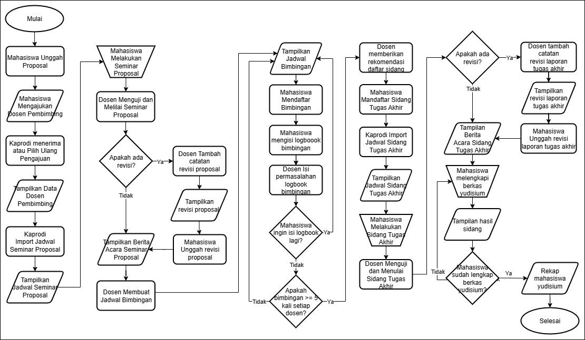
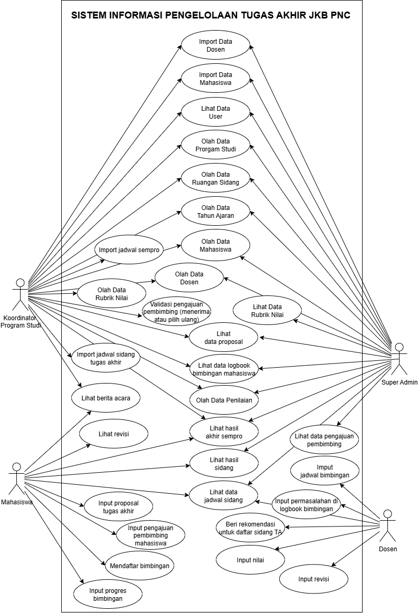
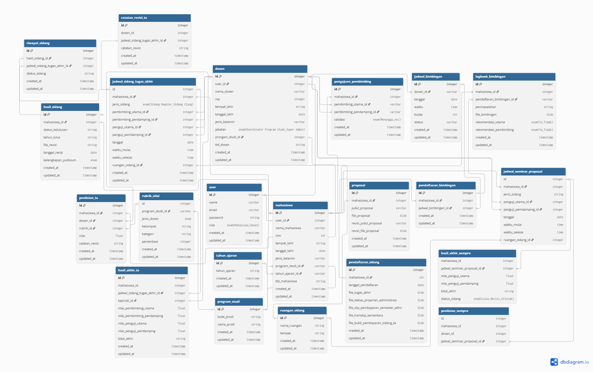

# FINAL PROJECT MANAGEMENT SYSTEM FOR THE COMPUTER AND BUSINESS DEPARTMENT AT POLITEKNIK NEGERI CILACAP WEB-BASED

# Overview
This system is a web-based application designed to support the Final Project Management process at the Department of Computer and Business, Politeknik Negeri Cilacap. It facilitates the processes of proposal submission, supervisor selection, guidance logbook, defense scheduling, grading, and meeting minutes. With this system, the management of final projects becomes more structured, efficient, and well-documented.

---

## Instalation

### 1. Clone the repository and navigate to the project directory:
```bash
git clone https://github.com/MariaIneFebrianti/ta-sipta-mariaine.git
cd ta-sipta-mariaine
```

### 2. Install dependencies:
```bash
composer install
npm install
npm run dev
```

### 3. Configure environment:
```bash
cp .env.example .env
php artisan key:generate
```

### 4. Run migrations and seeders:
```bash
php artisan migrate --seed
```

### 5. Start development server:
```bash
php artisan serve
```

---

## Data Modeling

### 1. Flowchart


### 2. Use Case Diagram


### 3. Entity Relationship Diagram (ERD)


---

## User Roles and Features

This system includes the following user roles and their respective functionalities:

### 1. **Super Admin**
  - Login  
  - View user data  
  - Manage study program data  
  - Manage seminar room data  
  - Manage academic year data  
  - Manage student data  
  - Manage lecturer data  
  - View grading rubric data  
  - Import student data  
  - Import lecturer data  
  - View proposal data  
  - View supervisor request data  
  - View supervision schedule data  
  - View seminar proposal schedule  
  - View final thesis defense schedule  
  - View supervision logbook data  
  - View final thesis defense registration  
  - View final seminar proposal results  
  - View final thesis defense results  
  - View student grade recap  
  - Logout  

---

### 2. **Koordinator Program Studi**
  - Login  
  - View user data  
  - Manage study program data  
  - Manage seminar room data  
  - Manage academic year data  
  - Manage student data  
  - Manage lecturer data  
  - Add grading rubric data  
  - Import student data  
  - Import lecturer data  
  - View proposal data  
  - Validate supervisor requests (approve or reassign)  
  - Print student supervisor recap  
  - Import seminar proposal schedule  
  - Import thesis defense schedule  
  - Print student examiner recap  
  - View supervision logbook data  
  - View thesis defense registration  
  - View seminar proposal results  
  - View thesis defense results  
  - View and print student grade recap  
  - Logout 

---

### 3. **Dosen**
  - Login  
  - View supervised and examined students  
  - View seminar proposal schedule  
  - Input seminar proposal grades  
  - Input seminar proposal revision notes  
  - Input supervision schedule  
  - Approve or reject supervision registration  
  - Input issues in supervision logbook  
  - Recommend students for thesis defense  
  - View students for examination  
  - View final thesis defense schedule  
  - Input thesis defense grades  
  - Input final thesis report revision notes  
  - Logout

  ---

### 4. **Mahasiswa**
  - Login  
  - Upload final project proposal  
  - Submit supervisor request  
  - Select supervision schedule (based on assigned supervisor) and register  
  - Fill in supervision logbook  
  - View seminar proposal schedule  
  - View proposal revision notes  
  - Upload revised proposal  
  - View thesis defense schedule  
  - View final thesis revision notes  
  - View seminar proposal result  
  - View thesis defense result  
  - Upload final thesis revision  
  - View and download official report documents  
  - Logout  

  ---

## System Workflow

### 1. Students upload their final project proposals.
### 2. Students submit their preferred academic supervisors through the system.
### 3. The Head of Study Program validates the supervisor submissions:
#### If approved, the submission status changes to "Acc".
#### If not approved, the Head of Study Program assigns a different supervisor, and the submission status also changes to "Acc".
### 4. The Head of Study Program prints the recap of student-supervisor assignments.
### 5. The Head of Study Program imports the proposal seminar schedule.
### 6. Students attend the seminar based on the assigned schedule.
### 7. Examiners provide grades through a dedicated page accessible only to authorized lecturers.
### 8. Examiners add revision notes for the proposal.
### 9. The system automatically calculates the seminar result and determines whether the student passes or needs revision.
### 10. The seminar report is generated and becomes accessible to the student and Head of Study Program.
### 11. Students revise and re-upload their final project proposals.
### 12. Supervisors create and manage supervision schedules for their assigned students.
### 13. Students view and register for available supervision schedules.
### 14. Students fill out the supervision logbook based on the registered schedule.
### 15. If further supervision is required, the process repeats with new schedule creation.
### 16. After completing at least five supervision sessions with each assigned supervisor, students can be recommended to register for the final defense.
### 17. Students register for the final defense by uploading all required documents, such as the final report, clearance letters, payment slips, and other supporting files.
### 18. The Head of Study Program imports the final defense schedule.
### 19. The Head of Study Program prints the list of examiners for the final defense.
### 20. Students and examiners can view the assigned final defense schedule.
### 21. Students attend the final defense as scheduled.
### 22. Supervisors and examiners submit grades through a dedicated page accessible only to authorized lecturers.
### 23. Supervisors and examiners provide revision notes for the final project report.
### 24. The system calculates the final defense result and determines the student's final status (pass, revision, reschedule, or fail).
### 25. Students revise and re-upload their final project report.
### 26. The Head of Study Program prints the recap of final defense grades.
### 27. The final defense report is generated and becomes accessible to the student and Head of Study Program.
### 28. The Head of Study Program verifies the completeness of graduation documents submitted by the student.
### 29. The Head of Study Program prints the graduation data recap.

---

## Contact

Email : mariainefebrianti29@gmail.com

---

## License

The Laravel framework is open-sourced software licensed under the [MIT license](https://opensource.org/licenses/MIT).

---
